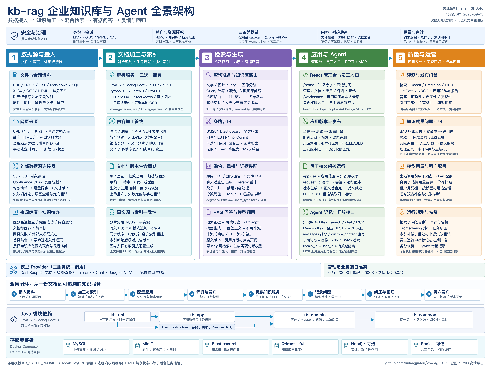
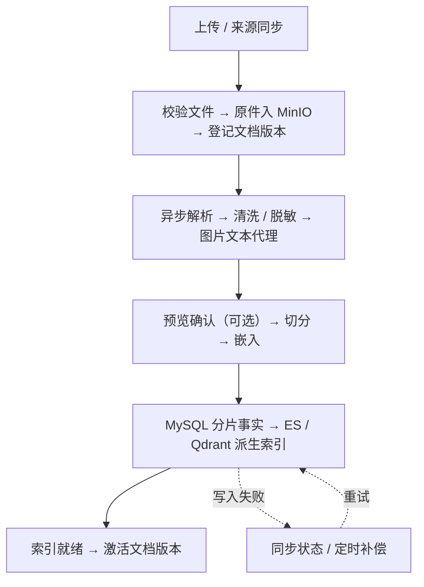
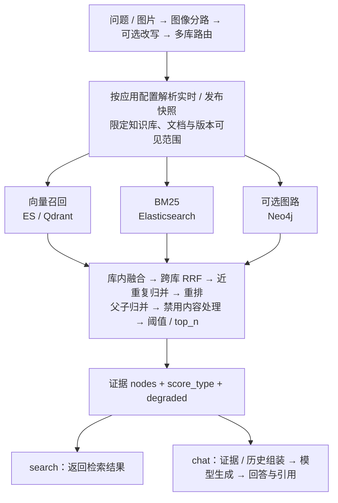
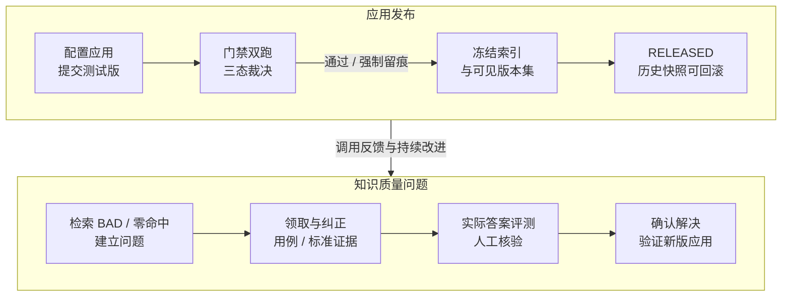
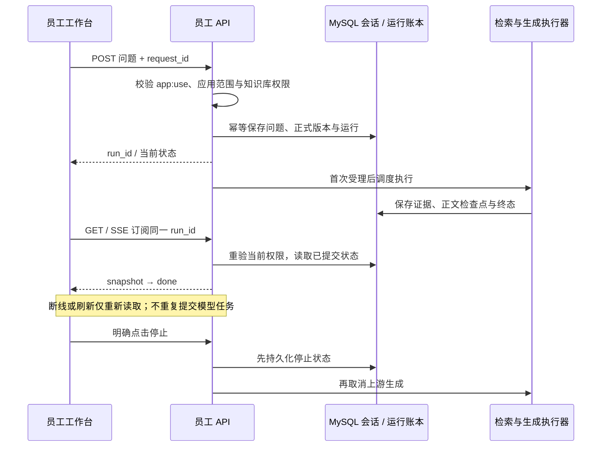

# kb-rag

[](LICENSE)
[](https://github.com/liulangjietou/kb-rag/actions/workflows/ci.yml)
[](https://openjdk.org/projects/jdk/17/)
[](https://spring.io/projects/spring-boot)
[](https://www.python.org/downloads/release/python-3110/)
[](https://nodejs.org/)

[](kb-rag-deploy/docker-compose.lite.yml)
[](kb-rag-deploy/docker-compose.lite.yml)
[](kb-rag-deploy/docker-compose.lite.yml)
[](kb-rag-deploy/docker-compose.yml)
[](kb-rag-deploy/docker-compose.lite.yml)
[](kb-rag-deploy/docker-compose.yml)
[](kb-rag-deploy/README.md)

可自托管的企业知识库与 RAG 系统，提供文档接入、混合检索、有据问答、评测发布与 Agent 长期记忆。
管理人员维护知识与应用，员工使用已授权的正式应用，外部系统通过 REST / MCP 接入。

[全景架构](#全景架构) · [核心流程](#核心流程) · [快速启动](#快速启动) · [对外接入](#对外接入) · [文档导航](#文档导航)

## 作品演示

[](https://www.bilibili.com/video/BV1ECe76iEBz/?spm_id_from=333.1368.list.card_archive.click&vd_source=03686e8b5675ab4a5314432c9c02feeb)

## 全景架构

[](docs/assets/kb-rag-architecture.png)

[查看高清 PNG（6144 × 4608）](docs/assets/kb-rag-architecture.png) · [下载可编辑 SVG](docs/assets/kb-rag-architecture.svg)

| 能力 | 当前实现 |
| --- | --- |
| 接入与加工 | 文件与聊天记录、网页抓取、S3 / OSS / Confluence；双解析实现、清洗脱敏、预览确认、父子切分与多模态索引 |
| 检索与回答 | BM25 + 向量、可选图路 / 图片检索、多库路由、融合与重排、引用与诊断、非流式 / SSE 问答 |
| 应用与员工 | 版本比较、评测门禁、快照发布与回滚；员工应用授权、持久会话、运行恢复、原文引用与答案评价 |
| 知识运营 | 首页待办与最近访问、来源健康、失败项重试、文档审核 / 有效期 / 回收站、质量问题纠正与回归 |
| Agent 与企业治理 | 长期记忆与画像、REST / MCP、多租户 / RBAC / 文档 ACL、SSO / 邮箱审核注册、Token 配额、审计与监控 |

### 工程组成

| 目录 | 职责 |
| --- | --- |
| [kb-rag-server](kb-rag-server/) | Java 17 / Spring Boot 主服务；业务编排、权限、索引、检索与全部模型调用 |
| [kb-rag-parse-java](kb-rag-parse-java/) / [kb-rag-parser](kb-rag-parser/) | Java / Python 两套解析服务，共用 HTTP 契约，二选一部署；输出 Markdown、页与图片 |
| [kb-rag-web](kb-rag-web/) | React 18 / TypeScript / Ant Design 管理台与员工工作台 |
| [kb-rag-deploy](kb-rag-deploy/) | Compose、环境变量模板、OpenAPI、部署与恢复手册 |

MySQL 保存业务事实，MinIO 保存原件与解析产物；ES / Qdrant / Neo4j 承载派生检索数据。
部署模板使用 `KB_CACHE_PROVIDER=local`（MySQL 会话 + 进程内权限缓存）；`redis` 模式共享会话与权限缓存。
后台任务仍采用[单实例执行基线](kb-rag-deploy/docs/DURABLE-SCHEDULING-DECISION.md)。

## 核心流程

### 1. 文档入库



无嵌入 Key 时分片标记 `SKIPPED`，仍可用 BM25 检索。是否对用户可见还受审核、有效期与授权控制。

### 2. 检索与回答



图示为文本混合检索主链；图片检索按多模态配置分路。可降级阶段通过 `degraded` 返回原因，
例如 `vector_route_unavailable`；需要生成回答时仍须配置对话模型。

### 3. 应用发布与质量回归



最终答案门禁由版本配置显式开启；质量问题通过当前用例、配置、语料、证据与评分核验后才能确认解决，修正结果用于后续发布。
发布快照固定语料基线，禁用内容和当前授权仍会约束可见性。员工答案评价单独保存，尚未自动转为知识质量问题。

### 4. 员工问答与断线恢复



历史与引用读取同样重验权限。进程中断后由过期扫描标记遗留运行，不自动重新生成答案。

## 快速启动

建议先用 **lite + 零 Key** 验证「上传 → 检索」：MySQL + Elasticsearch + MinIO，约需 8GB 可用内存。
full 模式使用独立 Qdrant，建议 16GB 以上。准备 Docker Compose、JDK 17、Maven 3.6+、Node.js 22；
选择 Python 解析服务时另需 Python 3.11+。

以下各代码块均从**仓库根目录**开始；解析、主服务和管理台分别占用一个终端。

### 1. 中间件

```bash
cd kb-rag-deploy
cp .env.example .env
# 编辑 .env，替换全部 CHANGE_ME_* 口令；DASHSCOPE_API_KEY 可留空
./scripts/preflight.sh lite
docker compose -f docker-compose.lite.yml up -d
docker compose -f docker-compose.lite.yml ps
```

等 `mysql`、`elasticsearch`、`minio` 均为 `healthy` 后启动应用。保留模板中的 `KB_CACHE_PROVIDER=local` 即无需 Redis。

### 2. 解析服务（二选一，终端 A）

```bash
# Java 实现
cd kb-rag-parse-java
mvn -B -ntp -DskipTests package
set -a; source ../kb-rag-deploy/.env; set +a
java -jar target/kb-rag-parse-java-1.1.0.jar --server.port=20001
```

<details>
<summary>改用 Python 实现</summary>

```bash
cd kb-rag-parser
python3.11 -m venv .venv
.venv/bin/pip install -r requirements.txt
set -a; source ../kb-rag-deploy/.env; set +a
.venv/bin/uvicorn app.main:app --host 127.0.0.1 --port 20001
```

两套实现共用 [解析契约](kb-rag-deploy/docs/openapi/kb-parser.yaml)，行为比对方法见 [Java 解析服务](kb-rag-parse-java/README.md#与-python-实现的等价性)。

</details>

### 3. Java 主服务（终端 B）

```bash
cd kb-rag-server
mvn -B -ntp -DskipTests package
set -a; source ../kb-rag-deploy/.env; set +a
java -jar kb-api/target/kb-rag-server.jar
```

`.env` 必须加载进启动进程，让应用与中间件使用相同凭据；每次修改后需重新 `source` 再重启。

### 4. 管理台（终端 C）与验证

```bash
cd kb-rag-web
npm ci
npm run dev
```

```bash
curl -fsS http://127.0.0.1:20001/health
curl -fsS http://127.0.0.1:20003/actuator/health
```

两个健康接口返回 `UP` 后，打开 [管理台](http://localhost:20002)。初始 `admin` 随机密码只在首次启动日志
`bootstrap administrator created` 中打印一次，首次登录需改密。默认管理端口 `20003` 仅绑定本机，详见 [管理端口说明](kb-rag-deploy/docs/ACTUATOR-SECURITY.md)。

**最短验证路径：** 新建知识库 → 上传文本资料 → 等待已就绪 → 检索调试查询原文关键词 → 返回相关分片。
零 Key 下预期出现 `vector_route_unavailable`。体验员工问答还需配置对话模型、发布应用，并分配 `app:use`、应用与知识库范围。

| 按需启用 | 操作要点 |
| --- | --- |
| 模型能力 | 配置 `DASHSCOPE_API_KEY` 并重启；历史 `SKIPPED` 文档需重建才会补向量 |
| Query 改写 | 显式设置 `RETRIEVAL_REWRITE_ENABLED=true`，默认关闭 |
| 邮箱注册 | 配置 SMTP、注册开关与独立 `REGISTRATION_HMAC_KEY`；管理员审核后才创建账号，见 [注册契约](kb-rag-deploy/docs/M26-CONTRACTS.md) |
| 完整部署 / 可选组件 | Qdrant、Neo4j、Redis、IK 分词、备份恢复见 [部署手册](kb-rag-deploy/README.md) |

停止三个应用进程后，在 `kb-rag-deploy` 中执行 `docker compose -f docker-compose.lite.yml down`。

## 对外接入

| 使用方 | 入口 | 凭据 |
| --- | --- | --- |
| 管理台 / 员工工作台 | `/api/v1/*` / `/api/v1/workspace/*` | 控制台会话头 `satoken` + 当前资源权限 |
| 知识库 REST / MCP | `/api/v1/knowledge/{search,chat,mcp}` | `Authorization: Bearer kb-sk-*` |
| 记忆库 REST / MCP | `/api/v1/memory/*` / `/api/v1/memory/mcp` | `Authorization: Bearer kb-mk-*` |

创建 API Key 并发布应用版本后，即可调用检索；省略 `app_version` 时使用当前 `RELEASED` 版本。

```bash
curl -fsS http://127.0.0.1:20000/api/v1/knowledge/search \
  -H 'Authorization: Bearer kb-sk-your-key' \
  -H 'Content-Type: application/json' \
  -d '{"app_id":"your-app-id","query":"报销标准是多少","top_n":5}'
```

结果位于 `data`，包括 `nodes` 与 `degraded`。改用 `/chat` 并增加 `"stream":true` 可获取 SSE 回答，事件为
`message_delta* → references → done`，异常通过 `error` 返回。零 Key 下 `search` 可用，`chat` 无对话模型时返回 `UPSTREAM_MODEL_ERROR`。

请求覆盖项为 `top_n`、`score_threshold`、`metadata_filter`、`max_content_length`；其他配置以应用版本为准。
MCP 客户端配置见 [MCP 接入指南](docs/MCP接入指南.md)，记忆抽取、画像及 `library_id + user_id` 隔离见 [记忆库指南](docs/记忆库接入指南.md)。

## 测试与质量门禁

[GitHub Actions](.github/workflows/ci.yml) 在 main 提交与 PR 上运行五组检查；下表命令在对应子目录执行。

| 子项目 | 检查 |
| --- | --- |
| `kb-rag-server` | `mvn -B -ntp verify -DexcludedGroups=browser` |
| `kb-rag-parser` | `pytest -q` |
| `kb-rag-parse-java` | `mvn -B -ntp verify` |
| `kb-rag-web` | `npm test`、`npm run lint`、`npm run build`、安装 Chromium 后 `npm run test:e2e` |
| `kb-rag-deploy` | 配置单测与 `scripts/validate_config.py`、四种 Compose 组合、OpenAPI / Shell 语法校验 |

浏览器夹具验证交互、布局与可访问性；真实模型质量、连接器网络和恢复演练按 [自测清单](docs/自测步骤.md) 单独验证。

## 文档导航

| 主题 | 文档 |
| --- | --- |
| 部署与排障 | [部署手册](kb-rag-deploy/README.md) · [管理端口](kb-rag-deploy/docs/ACTUATOR-SECURITY.md) · [备份恢复](kb-rag-deploy/docs/backup-restore.md) |
| 架构与详细流程 | [架构说明](kb-rag-deploy/docs/ARCHITECTURE.md) · [全量流程图](kb-rag-deploy/docs/FLOWS.md) · [任务调度边界](kb-rag-deploy/docs/DURABLE-SCHEDULING-DECISION.md) |
| 员工应用与问答 | [应用授权](kb-rag-deploy/docs/EMPLOYEE-APP-ACCESS.md) · [员工工作台](kb-rag-deploy/docs/EMPLOYEE-WORKSPACE.md) · [运行与恢复](kb-rag-deploy/docs/EMPLOYEE-RUN-RUNTIME.md) · [答案评价](kb-rag-deploy/docs/EMPLOYEE-ANSWER-FEEDBACK.md) |
| 知识运营 | [首页与来源健康](kb-rag-deploy/docs/HOME-SOURCE-HEALTH.md) · [失败项重试](kb-rag-deploy/docs/EXTERNAL-SOURCE-FAILED-RETRY.md) · [质量问题回归](kb-rag-deploy/docs/KNOWLEDGE-QUALITY-ISSUES.md) |
| 诊断与版本 | [问答诊断](docs/CHAT-DIAGNOSTICS.md) · [版本比较](docs/APP-VERSION-DIFF.md) · [模型用量诊断](docs/MODEL-USAGE-DIAGNOSTICS.md) |
| 开放契约 | [服务端 OpenAPI](kb-rag-deploy/docs/openapi/kb-server.yaml) · [解析 OpenAPI](kb-rag-deploy/docs/openapi/kb-parser.yaml) · [MCP](docs/MCP接入指南.md) · [记忆库](docs/记忆库接入指南.md) |
| 需求与开发 | [需求文档](docs/知识库需求文档.md) · [RAG 工程知识点](docs/RAG面试八股.md) · [贡献说明](CONTRIBUTING.md) · [里程碑契约目录](kb-rag-deploy/docs/) |

## 安全与许可

真实密钥和口令放在已忽略的 `.env` 或部署配置中；安全问题按各子项目 `SECURITY.md` 渠道私下报告。
项目代码采用 [Apache-2.0](LICENSE)。Python 解析服务依赖 PyMuPDF，Java 实现使用 PDFBox；
第三方许可分别见 [Python NOTICE](kb-rag-parser/NOTICE) 与 [Java NOTICE](kb-rag-parse-java/NOTICE)。

## 关注作者

如果你对 AI 及本项目感兴趣，欢迎关注我的微信公众号 **AI赛博炼丹炉**，将带来更多高质量文章和干货。

<p align="center">
  
</p>
