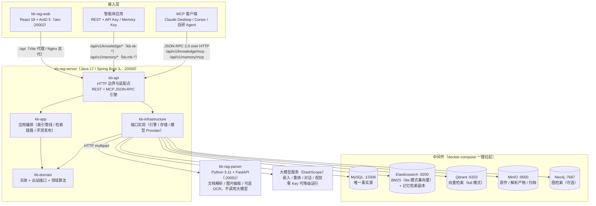
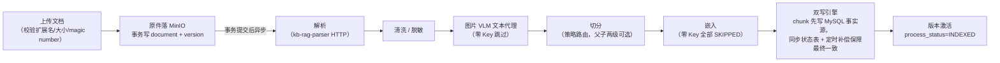
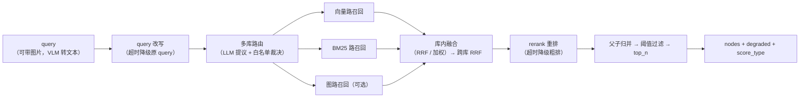
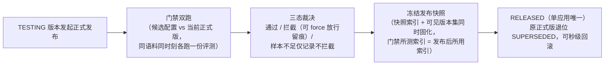
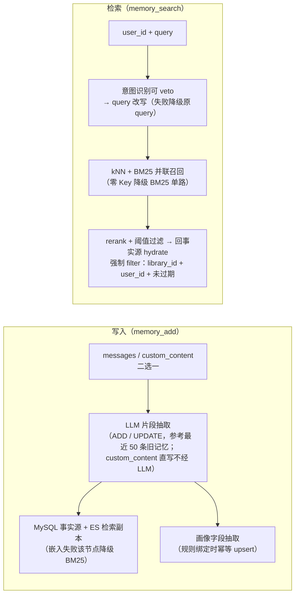
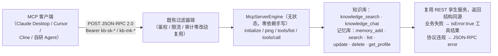

# kb-rag

可自托管、开箱即用的企业知识库 / RAG（检索增强生成）系统：上传文档 → 自动解析切分 →
双引擎混合检索（向量 + BM25）→ 标注与评测闭环 → 对外开放平台（REST + MCP），
并内置面向 Agent 的记忆库（长期记忆抽取 / 画像 / 记忆检索）。

**一句话架构**：Java 主服务（检索/管理编排）+ Python 解析服务（文档转 Markdown）+
React 管理台，三者围绕 MySQL（事实源）/ Elasticsearch 与 Qdrant（检索引擎）/
MinIO（对象存储）/ Neo4j（可选，图检索）构建，全部通过 docker-compose 一键拉起中间件。

> 本仓库由原先四个独立仓库（`kb-rag-server` / `kb-rag-parser` / `kb-rag-web` /
> `kb-rag-deploy`）合并而成，各子项目的完整提交历史已一并保留。

## 架构图



- **kb-rag-server**：唯一业务中枢，负责管理台 API、对外开放 API（REST + MCP）、索引管线编排、检索链路、记忆库与全部大模型调用。
- **kb-rag-parser**：纯解析微服务，只做文件解析与图片抽取，不调用任何大模型。
- **MySQL 是唯一事实源**：ES / Qdrant / Neo4j 均为派生索引，可从 MySQL 幂等重建。
- **三条独立鉴权链**：管理台 Bearer Token、知识库 API Key（`kb-sk-*`）、记忆库 Memory Key（`kb-mk-*`）；
  MCP 端点刻意落在既有过滤器前缀之下，零改动复用同一条鉴权 / 限流 / 审计管线。

## 核心流程图

### 索引管线：上传 → 解析 → 切分 → 嵌入 → 双写



### 检索链路：多路召回 → 融合 → 重排 → 过滤



每级均可选且带明确降级语义（`degraded` 原因码透出）；各路召回强制过滤版本可见集与 `enabled=1`。

### 应用发布：门禁双跑 → 快照冻结 → RELEASED



RELEASED 版本的对外调用永远命中冻结快照，后续文档增删不影响线上应用，直到发布新版本。

### 记忆库：写入抽取与检索（`/api/v1/memory/*`，Memory Key 鉴权）



一把 Memory Key 绑定一个记忆库，库内按 `user_id` 隔离；隔离是查询谓词，越权一律 404。

### MCP 协议层：一个 URL + 一把既有 Key 直接接入



接入配置与工具目录见 [`docs/MCP接入指南.md`](docs/MCP接入指南.md)、[`docs/记忆库接入指南.md`](docs/记忆库接入指南.md)。

更完整的架构说明与全量流程图（文档/版本状态机、双写补偿、索引重建、评测运行、图路、备份恢复等），见
[`kb-rag-deploy/docs/ARCHITECTURE.md`](kb-rag-deploy/docs/ARCHITECTURE.md) 与
[`kb-rag-deploy/docs/FLOWS.md`](kb-rag-deploy/docs/FLOWS.md)。

## 目录结构

| 子目录 | 职责 | 技术栈 |
| --- | --- | --- |
| [`kb-rag-server`](kb-rag-server/) | Java 主服务：知识库与文档生命周期、索引管线编排、检索融合、标注评测、应用发布、记忆库、对外 API（REST + MCP），以及全部大模型调用 | Java + Spring Boot + MyBatis |
| [`kb-rag-parser`](kb-rag-parser/) | Python 解析微服务：文档转结构化 Markdown + 按页文本 + 图片，聊天记录导出转结构化会话 | Python 3.11 + FastAPI |
| [`kb-rag-web`](kb-rag-web/) | React 管理台 | Vite + React 18 + TypeScript + Ant Design 5 |
| [`kb-rag-deploy`](kb-rag-deploy/) | 部署与契约：docker-compose 编排、环境变量模板、跨服务 OpenAPI 契约、备份与预检脚本、总体文档 | Docker Compose + Shell |

## 快速启动

推荐**轻量模式（lite）**：MySQL + Elasticsearch（同时承担 BM25 与向量检索）+ MinIO，
8GB 内存即可跑起来。不填 `DASHSCOPE_API_KEY` 即为**零 Key 模式**——不需要任何账号和
Key，clone 下来就能看到「上传 → 检索」跑通（检索自动降级 BM25 单路，依赖模型的功能置灰并给出引导）。

### 1. 拉起中间件

```bash
cd kb-rag-deploy
cp .env.example .env        # 编辑 .env：占位口令(CHANGE_ME_*)必须替换，DASHSCOPE_API_KEY 可选
./scripts/preflight.sh lite # 校验 docker / 内存 / 端口占用 / 是否还在用占位口令
docker compose -f docker-compose.lite.yml up -d
```

### 2. 启动应用层

```bash
# kb-rag-server（:20000，JDK 17 + Maven）
cd kb-rag-server && mvn -B -ntp -DskipTests package && java -jar kb-api/target/kb-rag-server.jar
```

```bash
# kb-rag-parser（:20001，Python 3.11）
cd kb-rag-parser && python3.11 -m venv .venv && .venv/bin/pip install -r requirements.txt && .venv/bin/uvicorn app.main:app --host 0.0.0.0 --port 20001
```

```bash
# kb-rag-web（dev :20002，Node）
cd kb-rag-web && npm install && npm run dev
```

首次启动 kb-rag-server 时会在日志中打印随机生成的 `admin` 初始密码，登录管理台
`http://localhost:20002` 后会强制修改密码。

配置 `DASHSCOPE_API_KEY` 后重启应用层即可获得向量检索、Query 改写、重排、VLM 图片理解等全部能力；
完整的部署模式、资源要求矩阵与 full 模式（独立 Qdrant / Redis）升级路径，见
[`kb-rag-deploy/README.md`](kb-rag-deploy/README.md)。

## 文档导航

| 文档 | 内容 |
| --- | --- |
| [`kb-rag-deploy/README.md`](kb-rag-deploy/README.md) | 部署总入口：部署模式、环境变量、ik 分词、备份恢复、各里程碑功能说明 |
| [`kb-rag-deploy/docs/ARCHITECTURE.md`](kb-rag-deploy/docs/ARCHITECTURE.md) | 系统整体架构 |
| [`kb-rag-deploy/docs/FLOWS.md`](kb-rag-deploy/docs/FLOWS.md) | 全量核心流程图（状态机、双写补偿、索引重建、评测、备份恢复等） |
| `kb-rag-deploy/docs/M1~M14-CONTRACTS.md` | 各里程碑接口契约（OpenAPI 契约见 `kb-rag-deploy/docs/openapi/`） |
| [`docs/MCP接入指南.md`](docs/MCP接入指南.md) | MCP 客户端（Claude Desktop / Cursor 等）接入配置与工具目录 |
| [`docs/记忆库接入指南.md`](docs/记忆库接入指南.md) | 记忆库 REST + MCP 接入、Memory Key 管理 |
| [`docs/知识库需求文档.md`](docs/知识库需求文档.md) | 需求全集与设计取舍 |
| [`docs/自测步骤.md`](docs/自测步骤.md) | 端到端自测清单 |
| 各子目录 `README.md` / `CONTRIBUTING.md` / `SECURITY.md` | 子项目自身的架构细节、开发规范与安全上报渠道 |

## 安全说明

`.env` 已在 [`.gitignore`](.gitignore) 中忽略，任何真实密钥、口令均不入库；提交前请以
`.env.example` 为模板，确保仅提交占位值。安全漏洞请通过各子目录的 `SECURITY.md` 渠道私下上报，不要开公开 issue。

## License

四个子项目均以 [Apache License 2.0](kb-rag-server/LICENSE) 许可发布。
