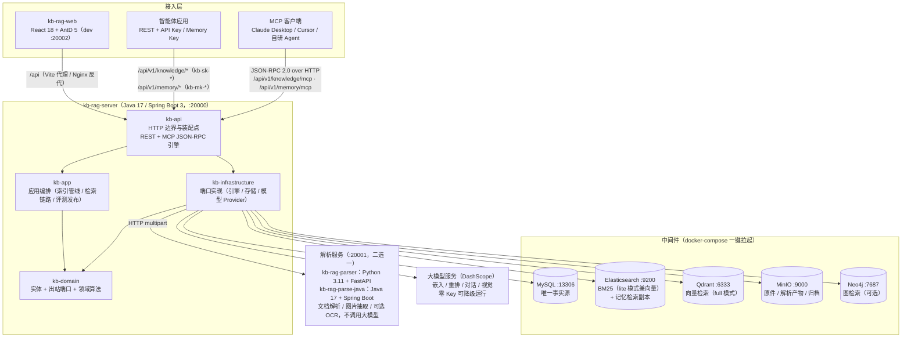
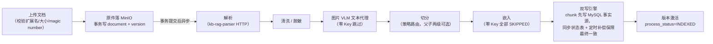
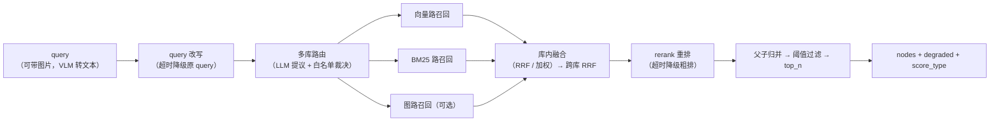
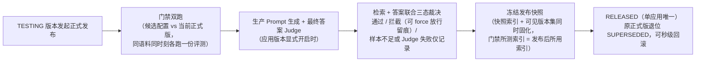
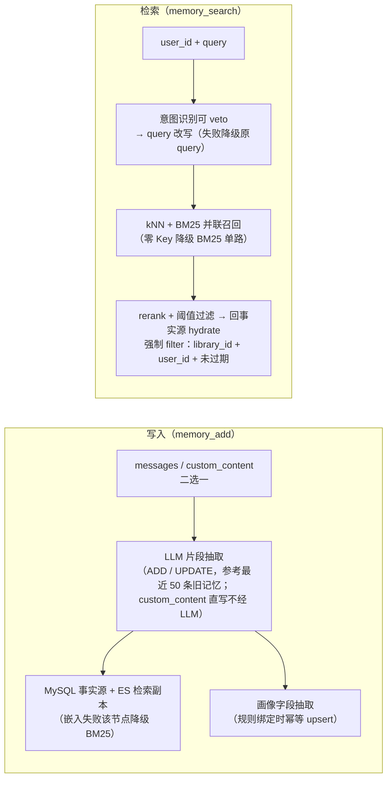
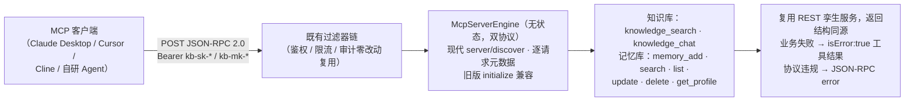

# kb-rag

[](LICENSE)
[](https://github.com/liulangjietou/kb-rag/actions/workflows/ci.yml)
[](https://openjdk.org/projects/jdk/17/)
[](https://spring.io/projects/spring-boot)
[](https://www.python.org/downloads/release/python-3110/)
[](https://nodejs.org/)

可自托管、开箱即用的企业知识库 / RAG（检索增强生成）系统：上传文档 → 自动解析切分 →
向量 + BM25 双路混合检索 → 标注与评测闭环 → 对外开放平台（REST + MCP），
并内置面向 Agent 的记忆库（长期记忆抽取 / 画像 / 记忆检索）。

**一句话架构**：Java 主服务（检索/管理编排）+ 解析服务（文档转 Markdown，Java 与 Python
两套实现，行为等价、二选一部署）+ React 管理台，三者围绕 MySQL（事实源）/ Elasticsearch
与 Qdrant（检索引擎）/ MinIO（对象存储）/ Neo4j（可选，图检索）构建，全部通过
docker-compose 一键拉起中间件。

> 本仓库由原先四个独立仓库（`kb-rag-server` / `kb-rag-parser` / `kb-rag-web` /
> `kb-rag-deploy`）合并而成，各子项目的完整提交历史已一并保留；
> `kb-rag-parse-java` 是合并之后新增的 Java 解析实现，与 `kb-rag-parser`（Python）二选一。

## 作品演示

[](https://www.bilibili.com/video/BV1LwtJ6DEk9/?vd_source=03686e8b5675ab4a5314432c9c02feeb)

> 界面截图尚未补齐（`docs/assets/` 目前只放了公众号二维码），完整交互先看上面的演示视频。

## 核心能力

| 能力域 | 已实现能力 |
| --- | --- |
| 数据接入 | PDF / DOCX / TXT / Markdown / SQL / XLSX / CSV / HTML / 图片上传，聊天记录导入，网页静态或 JS 渲染抓取，登录站点凭据，S3/OSS 与 Confluence Cloud 外部数据源连接器 |
| 索引与检索 | 文档版本化、可配置切分与父子分片、向量 + BM25 + 可选图路召回、RRF / 加权融合、Query 改写、重排、图片检索、多知识库路由 |
| 质量与治理 | 分片标注、检索与最终答案双层评测、最终答案五维 Judge、发布门禁、检索反馈与洞察、文档审核、有效期、回收站、索引补偿与重建 |
| 应用与 Agent | 应用版本发布与快照回滚、知识库 REST API、MCP 工具、SSE 流式问答、Agent 长期记忆抽取 / 画像 / 检索 |
| 企业与运维 | 多租户隔离、RBAC 与知识库数据范围、文档 ACL、LDAP / OIDC / SAML / CAS、限流与审计、模型 Token 成本台账与租户月配额、Prometheus 指标、备份恢复 |

当前实现基线覆盖 M1–M24；其中 M15 / M16 为权限与企业化能力，M17 / M18
为网页抓取增强，M19 为记忆库，M20 为 MCP 工具层，M21 为最终答案质量门禁，M22 为
MCP `2026-07-28` 双协议兼容，M23 为 Confluence Cloud 数据源连接器，M24 为模型用量与租户配额。
通用持久化任务调度经评审继续延后，投入门槛见
[`DURABLE-SCHEDULING-DECISION.md`](kb-rag-deploy/docs/DURABLE-SCHEDULING-DECISION.md)。详细边界以
[`ARCHITECTURE.md`](kb-rag-deploy/docs/ARCHITECTURE.md) 和现有里程碑契约为准。

## 架构图



- **kb-rag-server**：唯一业务中枢，负责管理台 API、对外开放 API（REST + MCP）、索引管线编排、检索链路、记忆库与全部大模型调用。
- **解析微服务**：纯解析，只做文件解析与图片抽取，不调用任何大模型。有两套**行为等价、二选一部署**的实现——
  [`kb-rag-parser`](kb-rag-parser/)（Python，契约的原始定义方与行为基准）与
  [`kb-rag-parse-java`](kb-rag-parse-java/)（Java，与主服务技术栈统一，且 pdf 路径改用 Apache-2.0 的
  PDFBox 从而不涉及 AGPL-3.0 义务）。两者监听同一端口、同一套契约与环境变量，`PARSER_BASE_URL`
  指向哪个都不需要改 kb-rag-server。
- **MySQL 是唯一事实源**：ES / Qdrant / Neo4j 均为派生索引，可从 MySQL 幂等重建。
- **三条独立鉴权链**：管理台会话（Sa-Token，请求头 `satoken`）、知识库 API Key（`kb-sk-*`）、
  记忆库 Memory Key（`kb-mk-*`，与前者同走 `Authorization: Bearer`）；
  MCP 端点刻意落在既有过滤器前缀之下，零改动复用同一条鉴权 / 限流 / 审计管线。

## 核心流程图

### 索引管线：上传 → 解析 → 切分 → 嵌入 → 双写



### 检索链路：多路召回 → 融合 → 重排 → 过滤



每级均可选且带明确降级语义（`degraded` 原因码透出）；各路召回强制过滤版本可见集与 `enabled=1`。

### 应用发布：门禁双跑 → 快照冻结 → RELEASED



RELEASED 版本的对外调用永远命中冻结快照，后续文档增删不影响线上应用，直到发布新版本。

### 记忆库：写入抽取与检索（`/api/v1/memory/*`，Memory Key 鉴权）



一把 Memory Key 绑定一个记忆库，库内按 `user_id` 隔离；隔离是查询谓词，越权一律 404。

### MCP 协议层：一个 URL + 一把既有 Key 直接接入



接入配置与工具目录见 [`docs/MCP接入指南.md`](docs/MCP接入指南.md)、[`docs/记忆库接入指南.md`](docs/记忆库接入指南.md)。

更完整的架构说明与全量流程图（文档/版本状态机、双写补偿、索引重建、评测运行、图路、备份恢复等），见
[`kb-rag-deploy/docs/ARCHITECTURE.md`](kb-rag-deploy/docs/ARCHITECTURE.md) 与
[`kb-rag-deploy/docs/FLOWS.md`](kb-rag-deploy/docs/FLOWS.md)。

## 目录结构

| 子目录 | 职责 | 技术栈 |
| --- | --- | --- |
| [`kb-rag-server`](kb-rag-server/) | Java 主服务：知识库与文档生命周期、索引管线编排、检索融合、标注评测、应用发布、记忆库、对外 API（REST + MCP），以及全部大模型调用 | Java + Spring Boot + MyBatis |
| [`kb-rag-parser`](kb-rag-parser/) | Python 解析微服务：文档转结构化 Markdown + 按页文本 + 图片，聊天记录导出转结构化会话。契约的原始定义方与行为基准 | Python 3.11 + FastAPI |
| [`kb-rag-parse-java`](kb-rag-parse-java/) | Java 解析微服务：与 `kb-rag-parser` 行为等价、二选一部署（两实现对拍 42/42 一致）。pdf 走 Apache-2.0 的 PDFBox，不涉及 AGPL-3.0 义务 | Java 17 + Spring Boot 3 |
| [`kb-rag-web`](kb-rag-web/) | React 管理台 | Vite + React 18 + TypeScript + Ant Design 5 |
| [`kb-rag-deploy`](kb-rag-deploy/) | 部署与契约：docker-compose 编排、环境变量模板、跨服务 OpenAPI 契约、备份与预检脚本、总体文档 | Docker Compose + Shell |

## 快速启动

推荐**轻量模式（lite）**：MySQL + Elasticsearch（同时承担 BM25 与向量检索）+ MinIO，
8GB 内存即可跑起来。不填 `DASHSCOPE_API_KEY` 即为**零 Key 模式**——不需要任何账号和
Key，clone 下来就能看到「上传 → 检索」跑通（检索自动降级 BM25 单路，依赖模型的功能置灰并给出引导）。

### 0. 环境要求

- Docker Engine / Docker Desktop，并支持 `docker compose`
- JDK 17、Maven 3.6+
- Python 3.11+（只有解析服务走 Python 实现 `kb-rag-parser` 时才需要；用 `kb-rag-parse-java` 则不需要）
- Node.js 22、npm
- lite 模式约需 8GB 可用内存；full 模式建议 16GB 以上

以下命令均从仓库根目录开始执行，应用层需要分别占用三个终端。

### 1. 配置并拉起中间件

```bash
cd kb-rag-deploy
cp .env.example .env
# 编辑 .env：所有 CHANGE_ME_* 占位口令必须替换；DASHSCOPE_API_KEY 可留空
./scripts/preflight.sh lite # 校验 docker / 内存 / 端口占用 / 是否还在用占位口令
docker compose -f docker-compose.lite.yml up -d
docker compose -f docker-compose.lite.yml ps
```

`mysql`、`elasticsearch`、`minio` 均显示 `healthy` 后，再启动应用层。

### 2. 启动解析服务（终端 A）

两套实现行为等价，任选其一，都监听 20001。

Python 实现：

```bash
cd kb-rag-parser
python3.11 -m venv .venv
.venv/bin/pip install -r requirements.txt
set -a; source ../kb-rag-deploy/.env; set +a
.venv/bin/uvicorn app.main:app --host 0.0.0.0 --port 20001
```

或 Java 实现（不需要 Python 环境）：

```bash
cd kb-rag-parse-java
mvn -DskipTests package
set -a; source ../kb-rag-deploy/.env; set +a
java -jar target/kb-rag-parse-java-1.1.0.jar
```

### 3. 构建并启动 Java 主服务（终端 B）

```bash
cd kb-rag-server
mvn -B -ntp -DskipTests package
set -a; source ../kb-rag-deploy/.env; set +a
java -jar kb-api/target/kb-rag-server.jar
```

> `source ../kb-rag-deploy/.env` 不能省略：中间件与应用必须使用同一组 MySQL / MinIO
> 凭据。上面的写法适用于 bash / zsh；其他 Shell 请使用等价的环境变量加载方式。

### 4. 启动管理台（终端 C）

```bash
cd kb-rag-web
npm install
npm run dev
```

### 5. 验证

```bash
curl -fsS http://127.0.0.1:20001/health
curl -fsS http://127.0.0.1:20003/actuator/health
```

两个接口分别返回 `{"status":"UP"}` 和整体状态 `UP` 后，打开
`http://localhost:20002`。首次启动 kb-rag-server 时会在日志中打印随机生成的 `admin`
初始密码，可搜索日志关键字 `bootstrap administrator created`；该密码只打印一次，首次登录后
系统会强制修改密码，请在首次启动时立即保存。若密码丢失，只能由另一名具备 `user:manage`
权限的管理员在用户管理中重置；当前没有未登录密码恢复入口，重启服务也不会重新生成密码。

`20003` 是默认只绑定 `127.0.0.1` 的独立管理端口，不与 `20000` 业务端口共同暴露。
远程 Prometheus 抓取方式与生产安全要求见
[`kb-rag-deploy/docs/ACTUATOR-SECURITY.md`](kb-rag-deploy/docs/ACTUATOR-SECURITY.md)。

完成登录后，按下面的最短路径验证零 Key 闭环：

1. 在「知识库」中新建知识库并上传一份包含可检索文本的文档。
2. 等待文档状态变为「已就绪」。
3. 进入「检索调试」，选择该知识库并查询文档中明确出现的关键词。
4. 结果应返回相关分片，同时降级提示包含 `vector_route_unavailable`，表示当前按预期使用 BM25 单路召回。

`DASHSCOPE_API_KEY` 是嵌入、重排、对话和视觉 Provider 的默认共享凭据。配置后重新加载 `.env`
并重启 Java 主服务，即可使用向量检索、重排、VLM 图片理解，以及由具体操作触发的对话、评测、
路由和记忆抽取能力；这些业务能力仍受应用版本配置、评测任务或记忆规则约束，不会在后台自动执行。
Query 改写还需显式设置 `RETRIEVAL_REWRITE_ENABLED=true`，因为它会给每次检索增加一次模型调用，默认关闭。
零 Key 模式下已入库文档的嵌入状态为 `SKIPPED`；补 Key 后需要在知识库详情对这些文档执行
逐篇或批量重建，旧文档才会生成向量，不能只重启服务。
每次修改 `.env` 后都要在启动该进程的终端重新执行 `set -a; source ../kb-rag-deploy/.env; set +a`，
否则 Shell 仍保留旧值。

完整的部署模式、资源要求矩阵与 full 模式（独立 Qdrant）升级路径，见
[`kb-rag-deploy/README.md`](kb-rag-deploy/README.md)。
full 编排中还预留了可选 Redis 容器，但当前 Java 主服务仍使用进程内限流，单实例运行不需要 Redis。

停止本地环境时，先在三个应用终端按 `Ctrl+C`，再执行：

```bash
cd ../kb-rag-deploy # 当前终端位于任一 kb-rag-* 子目录时
docker compose -f docker-compose.lite.yml down
```

## 对外 API 快速调用

管理台之外，知识库能力通过一条独立的开放 API 链路对外提供（前缀 `/api/v1/knowledge/*`，
走独立的鉴权 / 限流 / 审计过滤器链，与管理台会话完全分离）。

**准备两个值**：

1. **API Key**：登录管理台 →「设置 →  API Key 管理」→ 新建，得到 `kb-sk-` 开头的明文
   （只在创建时展示一次）。
2. **`app_id`**：在「应用」中创建应用并发布一个版本；不显式传 `app_version` 时，调用自动
   路由到该应用当前 `RELEASED` 版本。

### 检索：`POST /api/v1/knowledge/search`

```bash
curl -X POST "http://127.0.0.1:20000/api/v1/knowledge/search" \
  -H "Authorization: Bearer kb-sk-xxxxxxxx" \
  -H "Content-Type: application/json" \
  -d '{
    "app_id": "your-app-id",
    "query": "报销标准是多少",
    "top_n": 5
  }'
```

响应为统一外壳，业务负载在 `data` 中：

```json
{
  "code": "OK",
  "message": "success",
  "request_id": "req-xxxx",
  "data": {
    "nodes": [
      {
        "doc_id": "...",
        "document_version_id": "...",
        "chunk_id": "...",
        "chunk_type": "TEXT",
        "content": "命中的分片正文……",
        "score": 0.82,
        "score_type": "COSINE",
        "retrieval_source": "VECTOR",
        "metadata": {}
      }
    ],
    "degraded": ["vector_route_unavailable"],
    "app_version": "v1",
    "target_stage": "RELEASED"
  }
}
```

`degraded` 是本次调用的降级原因码数组，**它出现不代表调用失败**，而是明确告诉你哪一级能力
没生效。零 Key 模式下必然包含 `vector_route_unavailable`（向量路不可用，仅走 BM25 单路）。
全量枚举见 [OpenAPI 契约](kb-rag-deploy/docs/openapi/kb-server.yaml) 的 `DegradedReason`，
常见的还有 `rerank_timeout` / `rerank_error`（重排降级为融合排序）、`query_rewrite_timeout`
（改写降级为原 query）、`route_fallback_all`（多库路由未命中，降级检索全部关联库）、
`snapshot_index_missing`（发布快照索引缺失，回退实时别名）。

### 问答：`POST /api/v1/knowledge/chat`

入参与 `search` 相同，另含 `stream`（默认 `false`）。非流式返回 `{answer, references,
request_id, degraded, routed_kb_ids}`：

```bash
curl -X POST "http://127.0.0.1:20000/api/v1/knowledge/chat" \
  -H "Authorization: Bearer kb-sk-xxxxxxxx" \
  -H "Content-Type: application/json" \
  -d '{"app_id": "your-app-id", "query": "报销标准是多少"}'
```

`"stream": true` 时改为 `text/event-stream`，事件序列为
`message_delta*` → `references` → `done`（或 `error`），与管理台问答预览的事件契约完全一致：

```bash
curl -N -X POST "http://127.0.0.1:20000/api/v1/knowledge/chat" \
  -H "Authorization: Bearer kb-sk-xxxxxxxx" \
  -H "Content-Type: application/json" \
  -d '{"app_id": "your-app-id", "query": "报销标准是多少", "stream": true}'
```

> 零 Key 模式下 `chat` 返回 `502 UPSTREAM_MODEL_ERROR`（未配置对话模型），但 `search`
> 不受影响——这是刻意的边界：检索能力不依赖生成模型。

**请求级覆盖白名单只有四个字段**：`top_n`、`score_threshold`、`metadata_filter`、
`max_content_length`。其余应用配置一律以发布版本为准，传入未声明字段直接 `400 INVALID_PARAM`
而不是被静默丢弃——避免调用方以为改生效了、实际没有。

### MCP 接入

同一把 `kb-sk-*` Key、同一个 host，把路径换成 `/api/v1/knowledge/mcp` 即可作为 MCP Server
接入 Claude Desktop / Cursor / Cline；记忆库对应 `/api/v1/memory/mcp`（用 `kb-mk-*` Key）。
JSON-RPC 报文样例、工具目录与客户端配置见 [`docs/MCP接入指南.md`](docs/MCP接入指南.md)。

记忆库 REST 接口（`memory_add` / `search` / `list` / `update` / `delete` / `get_profile`）
见 [`docs/记忆库接入指南.md`](docs/记忆库接入指南.md)。

完整接口清单（含管理台全部 API）以 [`kb-server.yaml`](kb-rag-deploy/docs/openapi/kb-server.yaml)
为准。

## 测试与质量门禁

GitHub Actions 的唯一入口是仓库根目录 [`.github/workflows/ci.yml`](.github/workflows/ci.yml)。
每次提交到 `main` 或发起 Pull Request 时，并行执行以下五组门禁：

| Job | 环境 | 执行内容 |
| --- | --- | --- |
| `server` | JDK 17 | `mvn -B -ntp verify -DexcludedGroups=browser`；真实 Chromium 集成测试单独执行，不混入无浏览器依赖的基础门禁 |
| `parser` | Python 3.11 | 安装基础依赖并执行 `pytest -q` |
| `parse-java` | JDK 17 | `mvn -B -ntp verify`（Java 解析微服务全量测试） |
| `web` | Node.js 22 | `npm test`（Vitest）、`npm run lint`（oxlint）、`npm run build`（生产构建） |
| `deploy` | Python 3.11 | 配置一致性单测、环境变量模板校验、四种 compose 组合、OpenAPI YAML 与 Shell 语法校验 |

`server` 与 `parse-java` 失败时会上传 surefire 报告为构建产物，便于直接定位失败用例。

### 本地复现 CI

只跑改动涉及的那一组即可，命令与 CI 完全一致：

```bash
# Java 主服务
cd kb-rag-server && mvn -B -ntp verify -DexcludedGroups=browser

# Python 解析服务
cd kb-rag-parser && .venv/bin/pytest -q

# Java 解析服务
cd kb-rag-parse-java && mvn -B -ntp verify

# React 管理台
cd kb-rag-web && npm test && npm run lint && npm run build
```

配置模板或应用默认值发生变化时，另外至少执行：

```bash
cd kb-rag-deploy
python3 -m unittest discover -s tests -p 'test_*.py'
python3 scripts/validate_config.py
```

配置校验会拒绝 `.env.example` 重复键、开发机用户目录绝对路径，以及两份需求文档内容漂移。

### 两套解析实现的等价性对拍

CI 只保证两套解析实现各自的单元测试通过；「行为等价」这一说法的证据来自独立的对拍脚本
[`kb-rag-parse-java/tools/crosscheck.py`](kb-rag-parse-java/tools/crosscheck.py)——它把同一份
样例字节同时发给两个服务，逐项比对契约字段（当前覆盖 42 项，退出码非 0 即存在差异）。
需要两个服务同时运行，因此不在 CI 内，改动任一解析实现的行为时应手动跑一次：

```bash
# 终端 1：Python 实现
cd kb-rag-parser && .venv/bin/uvicorn app.main:app --port 20012

# 终端 2：Java 实现
cd kb-rag-parse-java && java -jar target/kb-rag-parse-java-*.jar --server.port=20011

# 终端 3：对拍
kb-rag-parser/.venv/bin/python kb-rag-parse-java/tools/crosscheck.py
```

比对口径与覆盖清单见 [`kb-rag-parse-java/README.md`](kb-rag-parse-java/README.md#与-python-实现的等价性)。

> 注：仓库根目录的 [`CONTRIBUTING.md`](CONTRIBUTING.md) 仍是四仓库合并前的 kb-rag-deploy
> 视角，只覆盖部署子项目的自查项，尚未更新为 monorepo 全量口径。以本节命令为准。

## 文档导航

| 文档 | 内容 |
| --- | --- |
| [`CONTRIBUTING.md`](CONTRIBUTING.md) | 代码原创红线、分支模型与提交规范、部署子项目自查清单（内容仍为合并前的 kb-rag-deploy 视角，待更新） |
| [`kb-rag-deploy/README.md`](kb-rag-deploy/README.md) | 部署总入口：部署模式、环境变量、ik 分词、备份恢复、各里程碑功能说明 |
| [`kb-rag-deploy/docs/ARCHITECTURE.md`](kb-rag-deploy/docs/ARCHITECTURE.md) | 系统整体架构 |
| [`kb-rag-deploy/docs/FLOWS.md`](kb-rag-deploy/docs/FLOWS.md) | 全量核心流程图（状态机、双写补偿、索引重建、评测、备份恢复等） |
| `kb-rag-deploy/docs/M1-CONTRACTS.md` ～ `M17-CONTRACTS.md`、`M19-CONTRACTS.md` ～ `M24-CONTRACTS.md` | 已落库的里程碑实现契约；M18 的站点凭据实现与后续隔离修复见架构文档 |
| [`kb-rag-deploy/docs/DURABLE-SCHEDULING-DECISION.md`](kb-rag-deploy/docs/DURABLE-SCHEDULING-DECISION.md) | 多实例持久化任务调度的延后结论、量化触发器与未来最小方案约束 |
| [`kb-rag-deploy/docs/ACTUATOR-SECURITY.md`](kb-rag-deploy/docs/ACTUATOR-SECURITY.md) | 管理端口隔离、远程 Prometheus 抓取与生产安全要求 |
| [`kb-rag-deploy/docs/backup-restore.md`](kb-rag-deploy/docs/backup-restore.md) | 备份与恢复操作手册 |
| [`kb-rag-deploy/docs/LOGIN-CAPTCHA-CONTRACT.md`](kb-rag-deploy/docs/LOGIN-CAPTCHA-CONTRACT.md) | 登录滑块验证码与凭据记忆契约 |
| [`kb-rag-deploy/sql/kb_rag_full_schema.sql`](kb-rag-deploy/sql/kb_rag_full_schema.sql) | 全量建表语句快照（V1~V25，48 张表），用于快速了解数据模型；实际建表以 Flyway 迁移脚本为准 |
| [`kb-rag-deploy/docs/openapi/kb-server.yaml`](kb-rag-deploy/docs/openapi/kb-server.yaml) | Java 主服务 OpenAPI 契约 |
| [`kb-rag-deploy/docs/openapi/kb-parser.yaml`](kb-rag-deploy/docs/openapi/kb-parser.yaml) | 解析服务 OpenAPI 契约（Java / Python 两套实现共用的规范来源） |
| [`docs/MCP接入指南.md`](docs/MCP接入指南.md) | MCP 客户端（Claude Desktop / Cursor 等）接入配置与工具目录 |
| [`docs/记忆库接入指南.md`](docs/记忆库接入指南.md) | 记忆库 REST + MCP 接入、Memory Key 管理 |
| [`docs/知识库需求文档.md`](docs/知识库需求文档.md) | 需求全集与设计取舍 |
| [`docs/自测步骤.md`](docs/自测步骤.md) | 端到端自测清单 |
| [`docs/RAG面试八股.md`](docs/RAG面试八股.md) | RAG 工程知识点整理：切分 / 嵌入 / 混合检索 / 融合 / 重排 / 评测 / 工程化全链路，每条对应本仓库的真实实现与参数 |
| 各子目录 `README.md` / `CONTRIBUTING.md` / `SECURITY.md` | 子项目自身的架构细节、开发规范与安全上报渠道 |

## 常见问题与故障排查

按「症状 → 先查什么」组织，覆盖首次部署最容易卡住的几处。部署模式、环境变量与 ik 分词的
完整说明仍以 [`kb-rag-deploy/README.md`](kb-rag-deploy/README.md) 为准。

### 启动阶段

**`docker compose up` 后容器起不来 / 端口被占**
先跑 `./scripts/preflight.sh lite`，它会逐个检查端口是否空闲并直接报出冲突的那一个。默认占用
MySQL `13306`、Elasticsearch `9200`、MinIO `9000` 与 `9001`；full 模式另有 Qdrant `6333`/`6334`
和可选 Redis `6379`。冲突时改 `.env` 里对应的 `*_PORT` 而不是去杀占用进程。

**preflight 报 `CHANGE_ME_*`**
`.env.example` 里的口令都是占位值，`MYSQL_ROOT_PASSWORD` / `MYSQL_PASSWORD` /
`MINIO_ACCESS_KEY` / `MINIO_SECRET_KEY`（full 模式还有 `QDRANT_API_KEY`）必须全部替换，
preflight 会拦住未替换的项。

**Elasticsearch 反复重启**
多数是内存不够。lite 模式至少留 8GB 可用内存给 Docker，full 模式建议 16GB 以上；preflight 会
先做一次内存检查。Docker Desktop 用户还需在设置里把分配给 Docker 的内存调够。

**找不到 admin 初始密码**
首次启动 kb-rag-server 时随机生成并**只在日志里打印一次**，搜索关键字
`bootstrap administrator created`。首次登录后强制改密。密码丢失时只能由另一名具备
`user:manage` 权限的管理员在用户管理中重置——当前没有未登录的密码恢复入口，重启服务也不会
重新生成。

**改了 `.env` 但不生效**
应用进程是从 Shell 环境变量读取配置的。每次改完 `.env`，都要在启动该进程的终端重新执行
`set -a; source ../kb-rag-deploy/.env; set +a` 再重启进程，否则 Shell 里仍是旧值。

### 文档与索引

**上传报「不支持的文件类型」**
默认扩展名白名单为 `pdf,docx,txt,md,sql,xlsx,csv,html,htm,png,jpg,jpeg,webp,bmp,gif`，
由 `UPLOAD_ALLOWED_EXTENSIONS` 控制。上传除扩展名外还会校验大小与 magic number，
改后缀绕不过去。单文件大小上限由 `UPLOAD_MAX_FILE_SIZE_MB`（默认 100）控制。

**文档一直卡在「解析中」**
解析是主服务通过 HTTP 调用解析微服务完成的。先确认解析服务活着：
`curl -fsS http://127.0.0.1:20001/health`，再核对主服务的 `PARSER_BASE_URL`
（默认 `http://127.0.0.1:20001`）确实指向它。两套解析实现二选一，端口和契约相同。

**补了 `DASHSCOPE_API_KEY`，但旧文档仍然没有向量**
零 Key 模式下入库的文档，嵌入状态是 `SKIPPED`。补 Key 后必须在知识库详情里对这些文档执行
逐篇或批量**重建**，只重启服务不会补算历史向量。

**中文检索召回明显偏差**
默认 ES 使用 `standard` 分词器，中文按字切分。装 ik 插件（`ik_max_word`）能显著改善，但
**装完必须重建索引**——mapping 的 analyzer 变了，存量索引不会自动迁移。步骤见
[`kb-rag-deploy/README.md`](kb-rag-deploy/README.md) 的「中文分词（IK）」。

### 检索与调用

**检索结果里出现 `degraded`**
这是设计上的显式降级透出，不是错误。零 Key 模式必然带 `vector_route_unavailable`（仅 BM25
单路）。其余原因码含义见上文[对外 API 快速调用](#对外-api-快速调用)。

**`chat` 返回 `502 UPSTREAM_MODEL_ERROR`**
未配置对话模型（典型是零 Key 模式）。`search` 不受影响——检索链路不依赖生成模型。

**API 调用返回 `400 INVALID_PARAM`**
请求级覆盖白名单只有 `top_n` / `score_threshold` / `metadata_filter` / `max_content_length`
四个字段，其余应用配置以发布版本为准。传入未声明字段会直接报错而非被静默忽略。

**Query 改写没生效**
改写会给每次检索额外增加一次模型调用，因此默认关闭，需显式设置
`RETRIEVAL_REWRITE_ENABLED=true`。

**`curl http://127.0.0.1:20003/actuator/health` 连不上**
`20003` 是独立管理端口且默认只绑定 `127.0.0.1`，不与 `20000` 业务端口一同暴露。远程抓取方式见
[`ACTUATOR-SECURITY.md`](kb-rag-deploy/docs/ACTUATOR-SECURITY.md)。

## 安全说明

`.env` 已在 [`.gitignore`](.gitignore) 中忽略，任何真实密钥、口令均不入库；提交前请以
`.env.example` 为模板，确保仅提交占位值。安全漏洞请通过各子目录的 `SECURITY.md` 渠道私下上报，不要开公开 issue。

## 许可与第三方依赖

各子项目的项目代码均以 Apache License 2.0 许可发布：
[`server`](kb-rag-server/LICENSE)、[`parser`](kb-rag-parser/LICENSE)、
[`parse-java`](kb-rag-parse-java/LICENSE)、[`web`](kb-rag-web/LICENSE)、
[`deploy`](kb-rag-deploy/LICENSE)。

需要特别注意：`kb-rag-parser` 直接依赖 PyMuPDF，而该依赖采用 AGPL-3.0 / 商业许可双重授权。
AGPL-3.0 带网络服务条款——以网络服务形式对外提供包含该代码的程序这一行为本身，就触发向服务
使用者提供完整对应源代码的义务，而解析服务恰恰就是网络服务。**部署 `kb-rag-parser` 前**请先阅读
[`kb-rag-parser/README.md`](kb-rag-parser/README.md#许可注意) 与
[`kb-rag-parser/NOTICE`](kb-rag-parser/NOTICE)，并根据实际使用方式完成许可证合规评估。

如果这条义务对你的场景不可接受，可以改用行为等价的 [`kb-rag-parse-java`](kb-rag-parse-java/)：
它的 pdf 路径走 Apache-2.0 的 Apache PDFBox，直接依赖全部为 Apache-2.0 / MIT / BSD-3-Clause，
传递依赖中只有 Logback 与 `jakarta.annotation-api` 两项弱 copyleft 双许可件，其义务仅在修改并
分发该库本身时触发，逐项核实见 [`kb-rag-parse-java/NOTICE`](kb-rag-parse-java/NOTICE)。
这不是法律意见，只是把两条路各自的触发条件摆出来供决策。

## 关注作者

如果你对 AI 及本项目感兴趣，欢迎关注我的微信公众号 **AI赛博炼丹炉**，将带来更多高质量文章和干货。

<p align="center">
  
</p>
