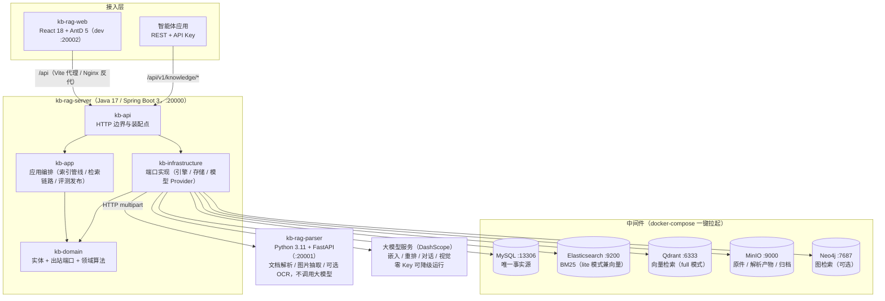
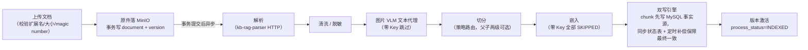
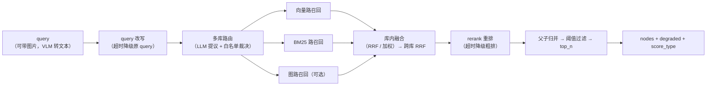

# kb-rag

可自托管、开箱即用的企业知识库 / RAG（检索增强生成）系统：上传文档 → 自动解析切分 →
双引擎混合检索（向量 + BM25）→ 标注与评测闭环 → 对外开放平台。

**一句话架构**：Java 主服务（检索/管理编排）+ Python 解析服务（文档转 Markdown）+
React 管理台，三者围绕 MySQL（事实源）/ Elasticsearch 与 Qdrant（检索引擎）/
MinIO（对象存储）/ Neo4j（可选，图检索）构建，全部通过 docker-compose 一键拉起中间件。

> 本仓库由原先四个独立仓库（`kb-rag-server` / `kb-rag-parser` / `kb-rag-web` /
> `kb-rag-deploy`）合并而成，各子项目的完整提交历史已一并保留。

## 架构图



- **kb-rag-server**：唯一业务中枢，负责管理台 API、对外开放 API、索引管线编排、检索链路与全部大模型调用。
- **kb-rag-parser**：纯解析微服务，只做文件解析与图片抽取，不调用任何大模型。
- **MySQL 是唯一事实源**：ES / Qdrant / Neo4j 均为派生索引，可从 MySQL 幂等重建。

## 核心流程图

### 索引管线：上传 → 解析 → 切分 → 嵌入 → 双写



### 检索链路：多路召回 → 融合 → 重排 → 过滤



每级均可选且带明确降级语义（`degraded` 原因码透出）；各路召回强制过滤版本可见集与 `enabled=1`。
更完整的架构说明与全量流程图（状态机、双写补偿、应用发布门禁等），见
[`../kb-rag-deploy/docs/ARCHITECTURE.md`](../kb-rag-deploy/docs/ARCHITECTURE.md) 与
[`../kb-rag-deploy/docs/FLOWS.md`](../kb-rag-deploy/docs/FLOWS.md)。

## 目录结构

| 子目录 | 职责 | 技术栈 |
| --- | --- | --- |
| [`kb-rag-server`](kb-rag-server/) | Java 主服务：知识库与文档生命周期、索引管线编排、检索融合、标注评测、应用发布、对外 API，以及全部大模型调用 | Java + Spring Boot + MyBatis |
| [`kb-rag-parser`](kb-rag-parser/) | Python 解析微服务：文档转结构化 Markdown + 按页文本 + 图片，聊天记录导出转结构化会话 | Python 3.11 + FastAPI |
| [`kb-rag-web`](kb-rag-web/) | React 管理台 | Vite + React 18 + TypeScript + Ant Design 5 |
| [`kb-rag-deploy`](kb-rag-deploy/) | 部署与契约：docker-compose 编排、环境变量模板、跨服务 OpenAPI 契约、备份与预检脚本、总体文档 | Docker Compose + Shell |

## 快速启动

```bash
cd kb-rag-deploy && cp .env.example .env
```

编辑 `.env` 填入数据库口令、MinIO 密钥与（可选的）`DASHSCOPE_API_KEY`，然后拉起中间件：

```bash
docker compose -f kb-rag-deploy/docker-compose.lite.yml up -d
```

完整的部署模式、资源要求矩阵、各里程碑接口契约与架构流程图，见
[`../kb-rag-deploy/README.md`](../kb-rag-deploy/README.md) 与 `../kb-rag-deploy/docs`。

## 安全说明

`.env` 已在 `../.gitignore` 中忽略，任何真实密钥、口令均不入库；提交前请以
`.env.example` 为模板，确保仅提交占位值。
