# kb-rag 流程图文档


> 版本：v1.8（基线与 `ARCHITECTURE.md` v2.6 相同 = M1-M23 及其后修复的状态；v1.7 基线为 M22）
> 日期：2026-08-14
> 作者：RichardFyoung / Claude
>
> 图使用 Mermaid 绘制（GitHub / 主流 IDE 原生渲染）。每张图标注对应的核心类与契约出处，与代码不一致时以代码为准并须在同一 PR 内修订本文档（项目铁律②）。

---

## 1. 文档上传与索引管线

对应：`DocumentService` / `IndexPipelineService` / `ChunkIndexWriter`（契约 M1 §4、M3 §3）。

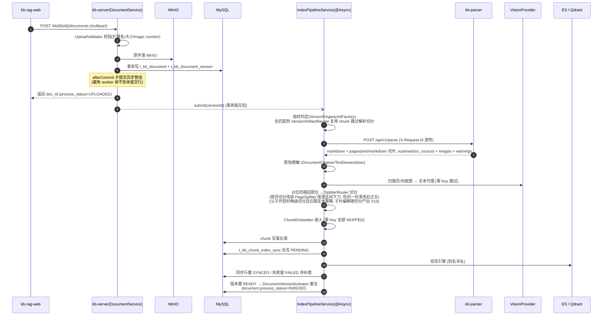

### 1.1 文档处理状态机（`process_status`，与 `config_stale` 正交）

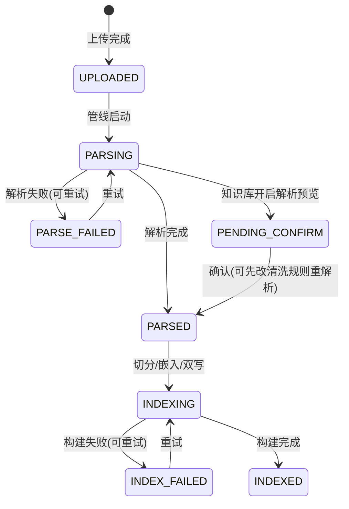

---

## 2. 文档版本状态机与回退

对应：`DocumentVersionPlanner` / `DocumentVersionActivator` / `VersionRetentionService` / `AppVersionPinChecker`（需求 §4.1，契约 M4a）。

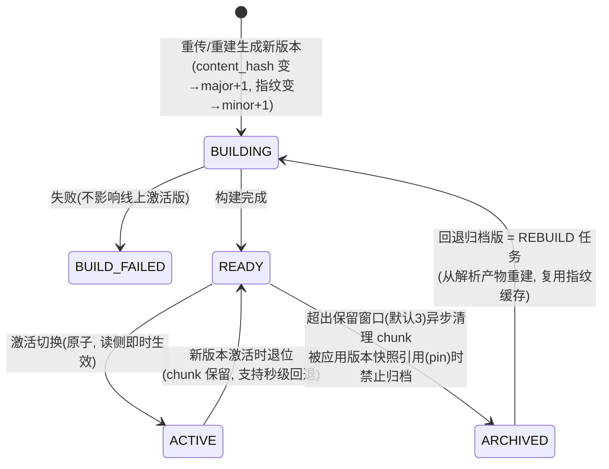

要点：激活关系以 `t_kb_document.current_version_id` 为准（同一文档至多一条 active，DB 唯一约束）；检索强制过滤"版本可见集"，切换激活版本即切换过滤值，无需重建索引。

---

## 3. 检索链路（含全部降级点）

对应：`RetrievalService` 及其协作者（需求 §4.4，契约 M2/M5/M6/M7/M9）。

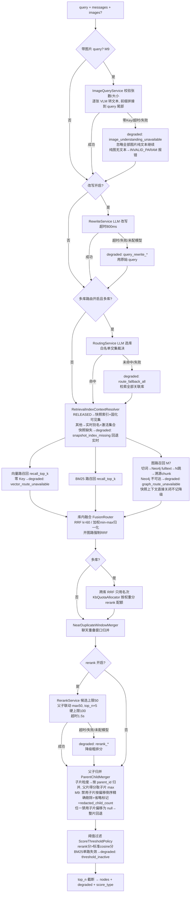

**强制不变式**（不出现在参数面板、不可关闭）：各路召回在引擎侧过滤 `document_version_id ∈ 可见集` 且 `enabled=1`；图路回溯 chunk 后回 MySQL 事实源二次复核同一谓词。

---

## 4. 双写一致性与补偿

对应：`ChunkIndexWriter` / `IndexSyncCompensationService` / `EngineChunkCleaner`（契约 M2 §2）。

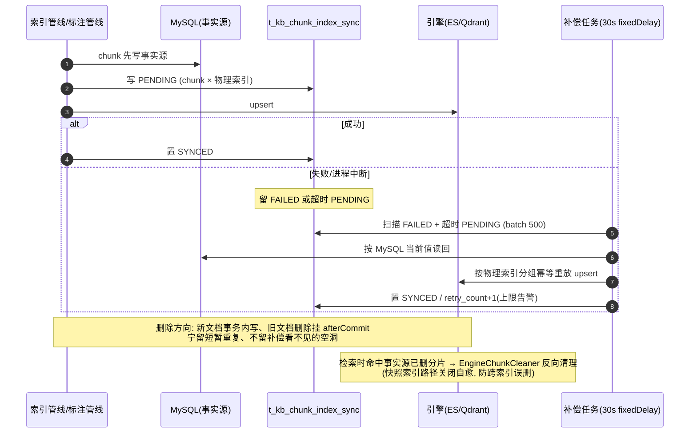

---

## 5. 索引重建与嵌入模型切换

对应：`RebuildService` / `IndexAliasManager` / `EsIndexAdmin`（需求 §4.3，v1.9 定版）。

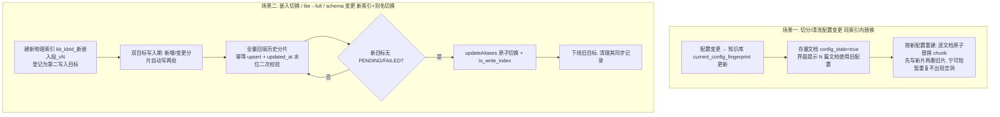

---

## 6. 应用发布：状态机、门禁双跑与索引快照

对应：`AppVersionService` / `ReleaseGateService` / `AppReleaseSnapshotService` / `IndexSnapshotService`（需求 §4.7，契约 M4c/M6）。

### 6.1 应用版本状态机

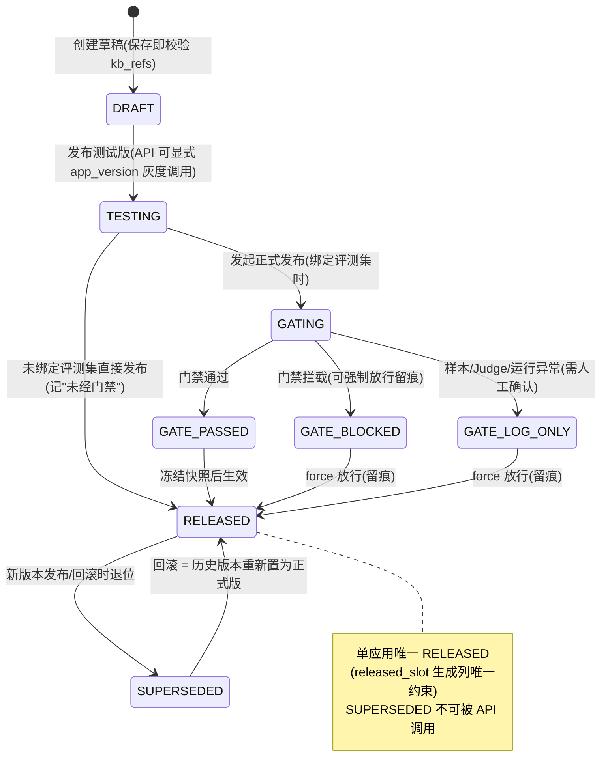

### 6.2 门禁双跑与快照冻结时序

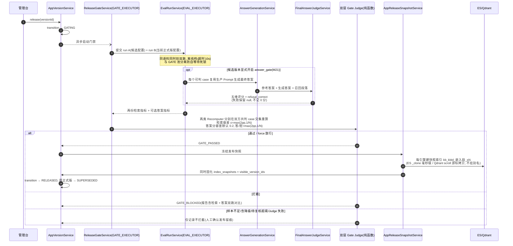

要点：快照创建晚于门禁双跑、早于 RELEASED 生效，保证"门禁所测索引 = 发布后所用索引"；`SUPERSEDED` 未清理时仍 pin 其可见集版本（回滚承诺）；快照按保留数（默认 3）由凌晨任务清理，RELEASED 永不清理。

---

## 7. 对外 API 调用链（search / chat）

对应：`ApiKeyAuthFilter` / `KnowledgeApiService` / `ApiAuditService`（需求 §4.8，契约 M4c）。

```mermaid
sequenceDiagram
    autonumber
    participant A as 智能体应用
    participant F as ApiKeyAuthFilter(独立过滤器链)
    participant K as KnowledgeApiService
    participant R as RetrievalService
    participant C as ChatProvider(版本快照模型)
    participant AU as ApiAuditService(@Async)

    A->>F: POST /api/v1/knowledge/search|chat<br/>Authorization: Bearer kb-sk-***
    F->>F: SHA-256 哈希比对 + app_scope 越权检查(403 记审计)
    F->>F: 令牌桶限流(超限 429 + Retry-After, 记审计; 401 不落审计)
    F->>K: 放行(request_id 已入 MDC)
    K->>K: app_version 路由(缺省→RELEASED, 显式→可调测试版 target_stage=beta)
    K->>K: RequestOverridePolicy 白名单校验<br/>(top_n/score_threshold/metadata_filter/max_content_length, 越界即 INVALID_PARAM)
    K->>R: 版本快照配置执行检索
    alt search
        K-->>A: nodes + request_id + degraded[]
    else chat (stream=true)
        K->>C: 生成(prompt 用分隔符包裹资料原文, 防注入)
        K-->>A: SSE: message_delta* → references(RetrievalNode) → done(含 degraded)
    end
    K--)AU: 异步落审计(query 摘要无条件脱敏, 命中文档, 耗时, 降级, target_stage)
    Note over AU: 180 天保留, 凌晨任务归档 MinIO 后分批物理删除
```

---

## 8. 聊天记录两步式导入

对应：`ChatImportService` / `ChatSessionMatcher` / `ChatWindowAggregator`（需求 §4.2，契约 M3/M8）。

```mermaid
sequenceDiagram
    autonumber
    participant W as 导入向导(web)
    participant S as ChatImportService
    participant PA as kb-parser
    participant DB as MySQL

    W->>S: 第一步 preview(file, 映射档案ID)
    S->>DB: 读 t_kb_source_mapping 取 profile_yaml
    S->>PA: POST /api/v1/parse/chat (profile_yaml 随请求下发)
    PA-->>S: sessions[] + skipped(语音/视频剔除统计)
    S->>S: ChatSessionMatcher 按"来源渠道+session_id"匹配库内既有聊天文档<br/>(缺 session_id 回退"会话名+首条时间戳")
    S-->>W: 匹配结果列表(新建/生成新版本) + upload_token(绑定 kbId 防跨库重放)
    W->>S: 第二步 confirm(upload_token)
    S->>DB: 已存在会话→该文档新版本(NEW_VERSION, 全量替换可回退)<br/>新会话→新文档; 多会话按会话拆分多文档
    S--)S: 走统一索引管线: 窗口聚合(时长/条数先到者关窗,<br/>window_overlap 滑动起点) → [time] sender: content 渲染<br/>→ 脱敏(默认开) → 切分嵌入双写<br/>会话/发送人/时间进 metadata 供 metadata_filter 过滤
```

---

## 9. 评测运行流程

对应：`EvalRunService` / `EvalHitJudge` / `EvalMetricsCalculator`（需求 §4.6，契约 M4b）。

```mermaid
flowchart TD
    S[提交评测: 数据集 × 配置矩阵 一次最多6个run] --> EST[estimate 费用护栏<br/>预估调用次数与费用]
    EST --> R[EvalRunService @Async EVAL_EXECUTOR<br/>固化 dataset_revision + 语料指纹<br/>激活版本集/嵌入版本/词典版本]
    R --> C[逐 case 走真实检索链路<br/>OfflineExecutionContext 离线档: 超时放宽10s<br/>降级 case 自动重试2次, 不计生产监控]
    C --> H{锚定类型}
    H -- span 级 --> H1[EvalHitJudge: 归一化字符重叠率<br/>分母固定为 span, 聚合覆盖并集≥阈值即命中<br/>父子开启时在命中子片集合上计算]
    H -- 文档级(图片) --> H2[Top-K 出现该文档任一衍生分片即命中<br/>按 image_urls 识别, 分组展示不混算]
    H1 & H2 --> M[EvalMetricsCalculator<br/>Recall@K / Precision@K / HitRate / MRR / NDCG@K<br/>Wilson 95% CI 仅展示不参与门禁<br/>单轮/多轮分组; evidence_stale 单列不计未命中]
    M --> J{LLM-as-judge 开启?}
    J -- 是 --> J1[固定版本化 prompt, temperature=0<br/>judge 独立于生成模型, 不参与门禁]
    J -- 否 --> RP
    J1 --> RP[报告: 指标对比表 + case 下钻 hit/hit_rank<br/>+ 降级明细 + compare 可比性判定]
```

---

## 10. 图路：抽取与检索（M7）

对应：`GraphExtractionService` / `GraphRetrievalService`（需求 §4.9/v1.13，契约 M7）。

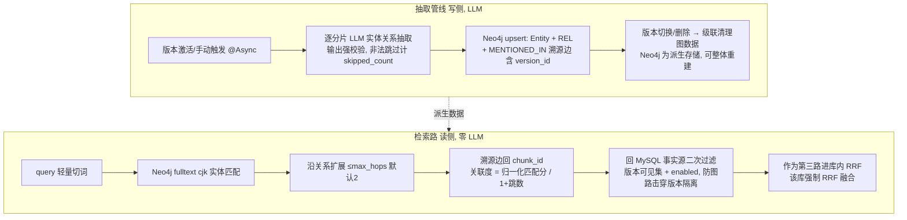

边界：`NEO4J_URI` 留空 = `DisabledGraphStore` 整体禁用零影响；快照上下文（RELEASED 调用）图路直接关闭、不记降级；Neo4j 不可达时 `degraded: graph_route_unavailable`，其余召回路正常。

---

## 11. 备份与恢复

对应：`scripts/backup.sh` / `restore.sh`（需求 §5，`backup-restore.md` 有真实演练记录）。

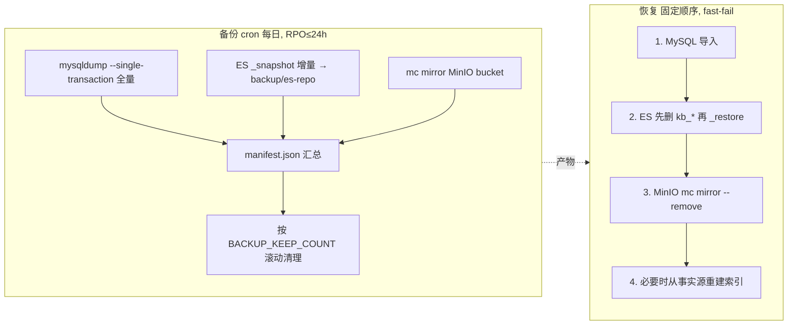

---

## 12. 零 Key 降级总览

各功能在未配置模型 Key 时的行为（需求 §5 零 Key 启动路径的实现口径）：

| 功能 | 零 Key 行为 |
|---|---|
| 检索 | BM25 单路，`degraded: vector_route_unavailable`；阈值失效透出 `threshold_inactive` |
| 嵌入 | `embedding_status=SKIPPED`，索引名嵌入段 `none`；配 Key 后走"启用向量检索"入口升级 |
| 切分 | 智能/LLM 语义切分回落按长度切分 |
| 改写/路由/rerank | 显式开启但未配模型 → `*_unavailable` 降级，链路继续 |
| VLM 图片理解 | 跳过文本代理（或由 parser 本地 PaddleOCR 兜底回填） |
| 图片 query（M9） | 忽略全部图片纯文本检索，`degraded: image_understanding_unavailable`；纯图片且无文本 query 返回 INVALID_PARAM |
| 问答生成 / judge / 图抽取 | 界面置灰 + 引导配置入口 |

---

## 13. 标注跨版本迁移建议（M9）

对应：`AnnotationMigrationAdvisor` / `ChunkAnnotationService`（需求 §4.5 二期项⑥转正，契约 M9 §0.4/0.5）。

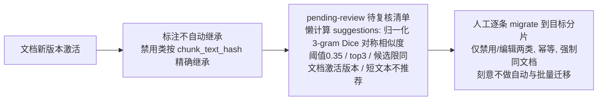

---

## 14. 记忆库：写入抽取与检索（M19）

对应：`MemoryKeyAuthFilter` / `MemoryApiService` / `MemoryExtractionService` / `EsMemoryStore`（契约 M19 §3/§5/§6）。

> 下面两张图画的都是**开放端**（`Bearer kb-mk-*`）。那条链上没有控制台主体，租户围栏整条跳过，隔离由 Key 绑定的唯一记忆库 + `user_id` 两层查询谓词完成 —— 这是刻意的，拼租户条件反而会把 Key 自己的库过滤掉。
> **管理端**（`/api/v1/memory-libraries`，控制台主体在线程上）多一层租户围栏：`t_kb_memory_library` 带 `tenant_id` 进 `FENCED_TABLES`，带 `libraryId` 的 21 个入口一律先经 `MemoryLibraryGuard` 解析库再碰从属表 —— 从属表不带租户列，跳过这一步等于没有围栏；库列表与建库两个入口无 `libraryId`，由围栏本体直接覆盖（契约 M19 §1.4，Flyway V21）。

### 14.1 AddMemory 写入与抽取时序

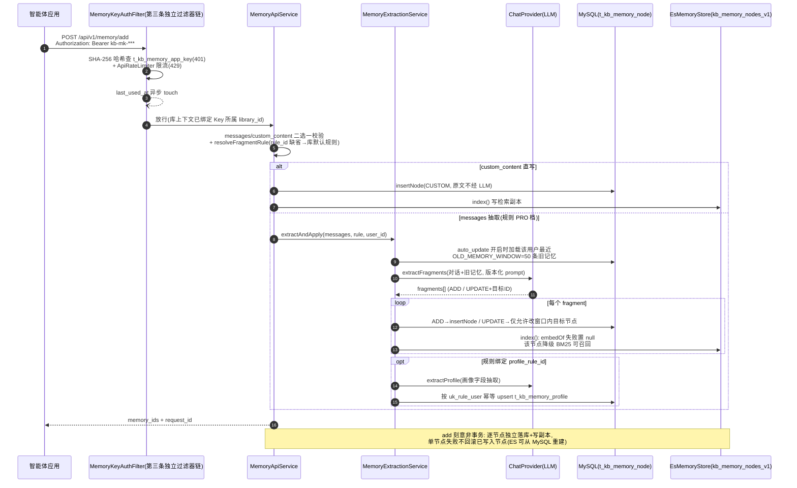

### 14.2 SearchMemory 检索链路

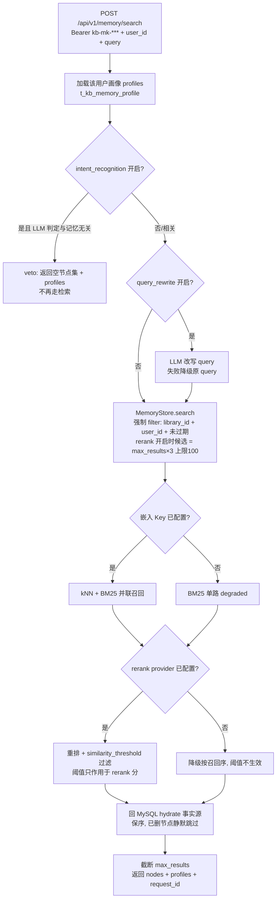

边界：跨库/跨用户数据不可见由检索强制 filter 与管理端两层隔离查询谓词双保险（他库资源一律 404 不泄露存在性）；节点过期只在查询期过滤，物理清理由凌晨任务完成。

---

## 15. MCP 双协议调用链（M20 / M22）

对应：`McpOriginValidationFilter` / `McpServerEngine` / `KnowledgeMcpController` / `MemoryMcpController` / `McpArgumentBinder`（契约 M22）。

两个端点共用同一引擎：`POST /api/v1/knowledge/mcp`（`Bearer kb-sk-*`，工具 knowledge_search / knowledge_chat）与 `POST /api/v1/memory/mcp`（`Bearer kb-mk-*`，memory_* 六工具）。MCP 是 REST 之外的第二种 transport——请求进 Controller 前先过 Origin，再进入与 REST 完全相同的鉴权/限流/审计链。

### 15.1 现代发现与旧版握手共存时序

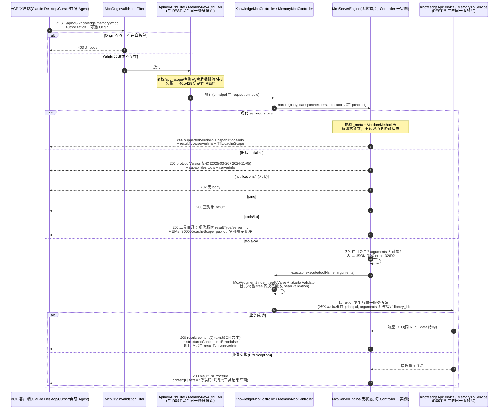

### 15.2 双时代 HTTP 与失败平面裁决

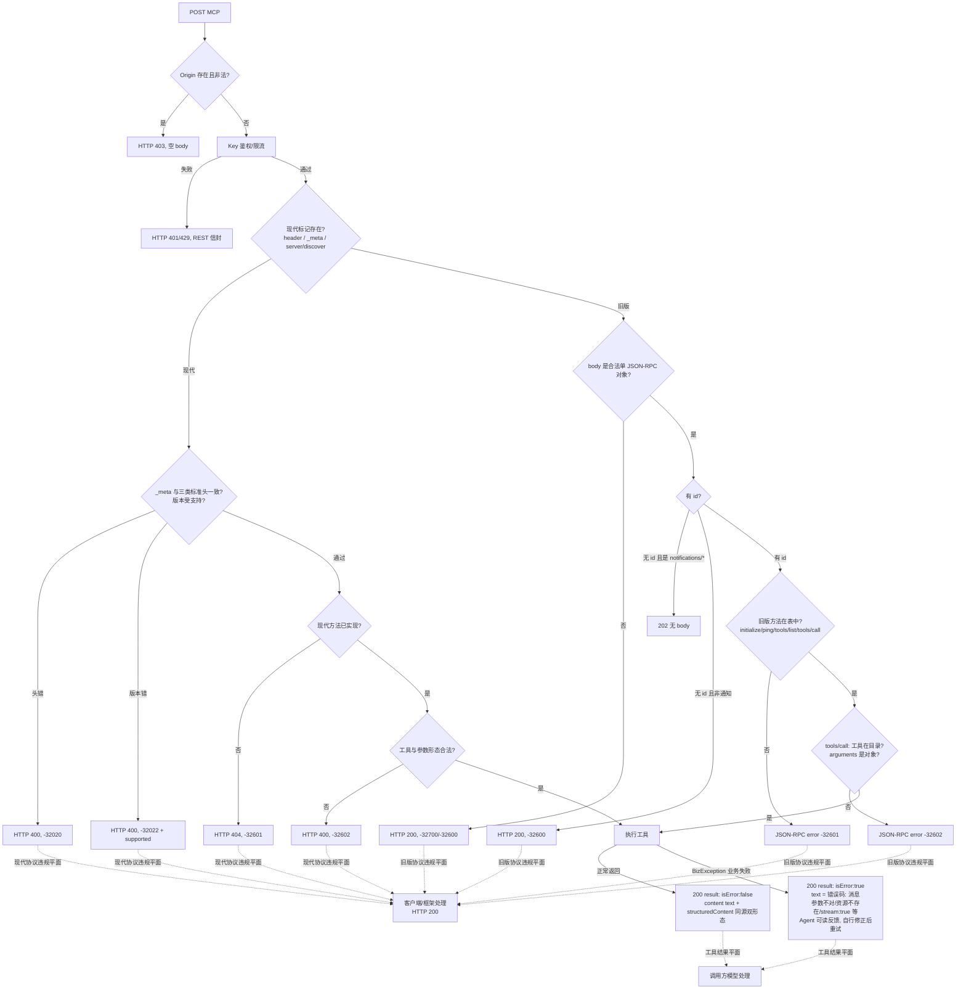

要点：协议错误仍由客户端框架修正，工具业务失败仍由模型读取 `isError: true` 后自纠；M22 只让现代协议的 HTTP 状态表达 transport 事实，不改变业务失败平面。`knowledge_chat` 的 `stream:true` 仍是 INVALID_PARAM 工具结果，流式生成继续走 REST SSE。

---

## 16. Confluence Cloud 增量同步（M23）

对应：`ExtSourceController` / `ExtSourceService` / `ConnectorRouter` / `ConfluenceCloudConnector` / `DocumentService`（契约 M23）。

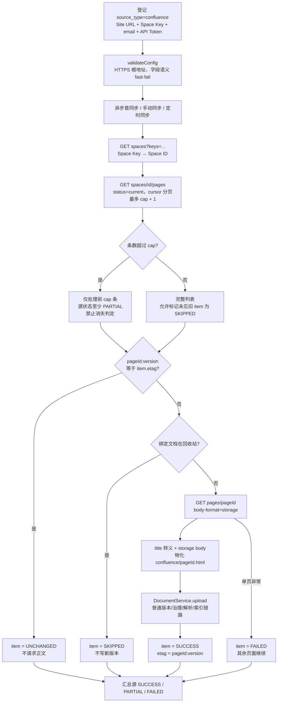

安全边界：JDK HttpClient 禁止自动重定向，body `_links.next` 与 HTTP Link header 都必须保持登记 Site URL 的同 origin 后才携带 Basic Token；列表/正文响应有体积上限。列表结构不完整、page 缺 id/version 或 cursor 循环直接判本轮失败，不能把上游异常翻译成“页面已删除”。
